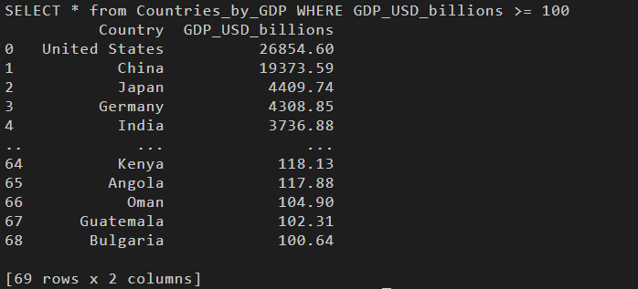

# Advanced ETL Project - Country GDP Data Pipeline

A complete ETL (Extract, Transform, Load) pipeline that retrieves country GDP data from Wikipedia, processes it, and stores it in both CSV and SQLite database formats for analysis.

## 📋 Project Overview

This project demonstrates a professional ETL workflow by:
- **Extracting** GDP data from the Wikipedia page on countries by nominal GDP
- **Transforming** raw data (converting currency formats and units)
- **Loading** processed data into both CSV files and a SQLite database
- **Logging** all operations for audit trails and debugging

The final dataset contains countries ranked by their GDP in USD billions, with countries having a GDP of $100B or more available for querying.

## 🎯 Features

✅ **Web Scraping**: Automatically extract data from Wikipedia using BeautifulSoup  
✅ **Data Transformation**: Convert currency strings to float values and normalize units  
✅ **Dual Storage**: Save processed data to both CSV and SQLite database  
✅ **Query Functionality**: Run SQL queries on the stored data  
✅ **Logging System**: Track all ETL operations with timestamps  
✅ **Error Handling**: Robust data extraction with validation checks  

## 📊 Output Example

The pipeline processes and filters country GDP data for countries with GDP ≥ $100B:



Sample data showing countries ranked by GDP (in USD billions).

## 🛠️ Tech Stack

- **Python 3.x**
- **BeautifulSoup4**: HTML parsing and web scraping
- **Pandas**: Data manipulation and CSV handling
- **NumPy**: Numerical operations
- **SQLite3**: Database operations
- **Requests**: HTTP requests for web scraping

## 📁 Project Structure

```
Advanced ETL project/
├── etl_project_gdp.py          # Main ETL script
├── Countries_by_GDP.csv        # Output CSV file with processed data
├── World_Economies.db          # SQLite database with country GDP table
├── etl_project_log.txt         # Execution logs with timestamps
└── README.md                   # This file
```

## 🚀 Getting Started

### Prerequisites

Ensure you have Python 3.x installed, then install required dependencies:

```bash
pip install bs4 requests pandas numpy
```

### Running the Pipeline

Execute the ETL pipeline:

```bash
python etl_project_gdp.py
```

The script will:
1. Extract GDP data from Wikipedia
2. Transform the data (clean formatting, convert units)
3. Load data to `Countries_by_GDP.csv`
4. Create and populate `World_Economies.db` SQLite database
5. Execute a sample query for countries with GDP ≥ $100B
6. Log all operations to `etl_project_log.txt`

## 📊 Data Output

### CSV Output
`Countries_by_GDP.csv` - Cleaned and transformed GDP data with columns:
- `Country`: Country name
- `GDP_USD_billions`: GDP in billions of USD (rounded to 2 decimal places)

### Database Output
`World_Economies.db` - SQLite database containing:
- `Countries_by_GDP` table with all processed records
- Ready for further SQL queries and analysis

### Activity Log
`etl_project_log.txt` - Timestamp-tracked log of all ETL operations

## 🔍 Key Functions

| Function | Purpose |
|----------|---------|
| `extract()` | Scrapes Wikipedia table and creates initial DataFrame |
| `transform()` | Cleans data, converts formats, and normalizes units |
| `load_to_csv()` | Exports DataFrame to CSV file |
| `load_to_db()` | Stores DataFrame in SQLite table |
| `run_query()` | Executes SQL queries on the database |
| `log_progress()` | Records timestamped operation logs |

## 📝 Logging

All ETL operations are logged with timestamps in `etl_project_log.txt`:

```
2024-May-15-10:30:45 : Preliminaries complete. Initiating ETL process
2024-May-15-10:30:47 : Data extraction complete. Initiating Transformation process
2024-May-15-10:30:48 : Data transformation complete. Initiating loading process
...
```

## 💡 Use Cases

- Analyze global economic trends
- Track GDP changes over time
- Build reports on country economies
- Foundation for financial analysis projects
- Educational demonstration of ETL concepts

## 🎓 Learning Outcomes

This project demonstrates:
- Web scraping and data extraction techniques
- Data cleaning and transformation best practices
- Database design and SQL operations
- Logging and error handling patterns
- Complete ETL pipeline architecture


## 👤 Author

Created as part of Coursera's Advanced ETL course
